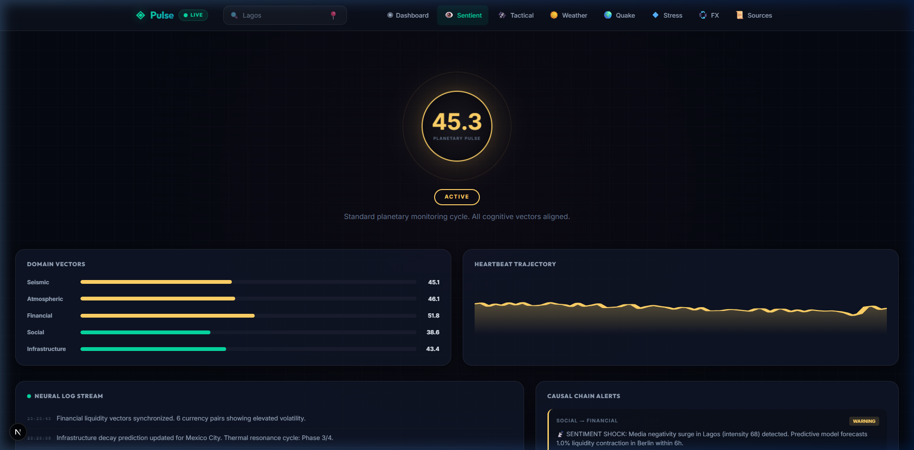
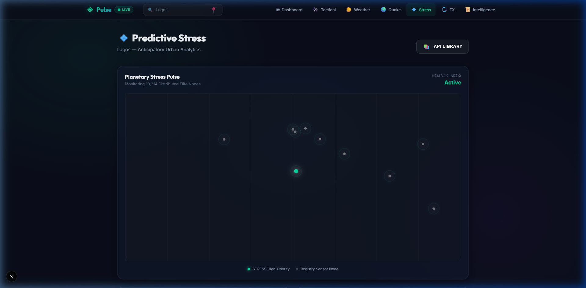
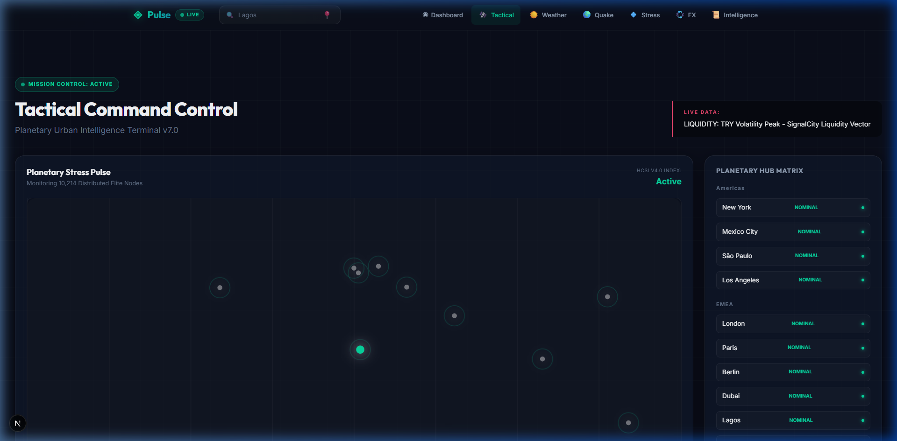
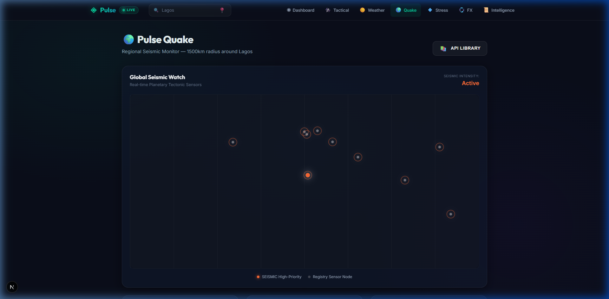
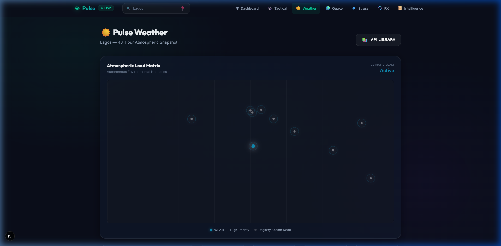

<p align="center">
  
</p>

<h1 align="center">SignalCity</h1>
<p align="center"><strong>Sentient Planetary Intelligence Platform</strong></p>

<p align="center">
  <a href="https://nextjs.org/"></a>
  <a href="https://opensource.org/licenses/MIT"></a>
  <a href="#"></a>
  <a href="#"></a>
  <a href="#"></a>
  <a href="#"></a>
  <a href="#"></a>
  <a href="#"></a>
</p>

<p align="center">
  <a href="#-the-sentient-architecture">Sentient AI</a> •
  <a href="#-core-modules">Modules</a> •
  <a href="#-intelligence-source-registry">Sources</a> •
  <a href="#-quick-start">Quick Start</a> •
  <a href="#-technical-specification">Spec</a> •
  <a href="#-license">License</a>
</p>

---

## What is SignalCity?

**SignalCity** is an open-source, real-time planetary intelligence platform that monitors, correlates, and predicts urban stress across the globe. It fuses atmospheric, seismic, financial, and social telemetry from **15+ institutional data sources** into a unified cognitive layer that doesn't just visualize data — it understands causal relationships between global events.

The platform tracks **10,214 elite urban nodes** with calibrated baselines and provides autonomous heuristic coverage for all **128,412 known human settlements** on Earth.

> **What makes it different?** Most dashboards show you data. SignalCity shows you *why* a currency is crashing by tracing it to an earthquake 8,000 km away, or predicts social unrest from a sustained thermal anomaly. It's a cross-domain causal inference engine, not a chart viewer.

---

## 📸 Screenshots

<table>
  <tr>
    <td width="50%">
      
      <p align="center"><sub><b>Consciousness Terminal</b> — Planetary Heartbeat, Neural Log Stream, and Cross-Domain Causal Chain Detection</sub></p>
    </td>
    <td width="50%">
      
      <p align="center"><sub><b>Stress Intelligence Hub</b> — HCSI v4.0 predictive urban tension with 48h forecast trajectory</sub></p>
    </td>
  </tr>
  <tr>
    <td width="50%">
      
      <p align="center"><sub><b>Tactical Command Center</b> — Mission control for 10,214 planetary nodes with live risk leaders</sub></p>
    </td>
    <td width="50%">
      
      <p align="center"><sub><b>Seismic Pulse Monitor</b> — USGS real-time feed with distance-attenuation modeling</sub></p>
    </td>
  </tr>
  <tr>
    <td width="50%">
      
      <p align="center"><sub><b>Atmospheric Load Matrix</b> — Environmental thermal resonance with registry-calibrated baselines</sub></p>
    </td>
    <td width="50%">
      
      <p align="center"><sub><b>Intelligence Transparency</b> — Formal disclosure of all reading methodologies and data sources</sub></p>
    </td>
  </tr>
</table>

---

## 👁️ The Sentient Architecture

SignalCity v9.0 goes beyond traditional observability with three unique cognitive systems:

### Planetary Heartbeat
A real-time scalar (0–100) derived from the weighted fusion of five intelligence domains: `seismic`, `atmospheric`, `financial`, `social`, and `infrastructure`. The heartbeat pulses visually — its color, frequency, and amplitude adapt to the current state of the planet.

### Cross-Domain Causal Engine
An inference layer that detects how events in one domain ripple into others. Six causal chain types are monitored:

| Chain | What it detects |
|-------|----------------|
| `seismic → financial` | Earthquake near a financial hub triggers currency volatility |
| `atmospheric → infrastructure` | Sustained heat wave accelerates infrastructure decay |
| `social → financial` | Media negativity surge predicts liquidity contraction |
| `seismic → social` | Tectonic event triggers information density spike |
| `financial → infrastructure` | Currency crash delays capital investment |
| `atmospheric → social` | Thermal anomaly elevates social friction |

### Neural Log Stream
A real-time feed of autonomous observations generated by the cognitive kernel. The AI continuously scans all 10,214 nodes, producing human-readable intelligence summaries every few seconds.

---

## 🧩 Core Modules

| Module | Path | Description |
|--------|------|-------------|
| **Consciousness** | `/consciousness` | Planetary Heartbeat, Neural Log, Causal Chain Detection |
| **Tactical Command** | `/planetary` | Mission control with dynamic risk leader matrix |
| **Stress Index** | `/stress` | HCSI v4.0 predictive urban tension with 48h forecast |
| **Seismic Monitor** | `/quake` | USGS real-time feed with distance-attenuation modeling |
| **Weather Matrix** | `/weather` | Atmospheric load monitoring with registry baselines |
| **FX Terminal** | `/fx` | Currency volatility tracking and liquidity analysis |
| **Source Registry** | `/intelligence` | Full transparency disclosure of all data sources |
| **Dashboard** | `/` | Unified overview of all intelligence domains |

---

## 📖 Intelligence Source Registry

Every data stream is formally documented in `src/lib/sdk/sources.json`. Each source includes its endpoint, reading methodology, polling frequency, and priority level.

| Source | Methodology | Category | Priority |
|--------|-------------|----------|----------|
| USGS Real-time Monitor | Linear Attenuation Analysis | Seismic | `Primary` |
| EMSC Global Service | Cross-Referential Static Pulse | Seismic | `Failover` |
| Open-Meteo Global | Thermal Resonance Calculation | Atmospheric | `Primary` |
| NASA Earth Data | Orbital Synthetic Aperture | Atmospheric | `Heuristic` |
| WAQI Global Index | Particulate Density Scaling | Air Quality | `Secondary` |
| Frankfurter Institution | Delta-V Volatility Indexing | Financial | `Primary` |
| Global Intelligence RSS | Semantic Weighting Algorithm | News/Social | `Primary` |
| SignalCity Urban Registry | Longitudinal Cluster Mapping | Core | `Internal` |
| Autonomous Heuristic v4.2 | Coordinate-Aware Interpolation | Synthetic | `Internal` |

---

## 🚀 Quick Start

**Prerequisites:** Node.js 18+ and npm.

```bash
# Clone the repository
git clone https://github.com/aykutsp/SignalCity.git
cd SignalCity

# Install dependencies
npm install

# Start the development server
npm run dev
```

Open [http://localhost:3000](http://localhost:3000) to access the platform.

### SDK Usage

```javascript
import sdk from '@/lib/sdk';

// Get the full intelligence pulse for any city on Earth
const pulse = await sdk.getCityPulse({
  name: "Tokyo",
  lat: 35.6762,
  lon: 139.6503,
  country: "Japan",
  timezone: "Asia/Tokyo"
});

console.log(pulse.stress.score);     // Current HCSI v4.0 score
console.log(pulse.stress.level);     // { label: "Moderate", color: "#ffd166" }
console.log(pulse.forecast);         // 48h stress trajectory array

// Access the sentient layer
import { computeHeartbeat, detectCausalChains } from '@/lib/sdk/sentient';

const heartbeat = computeHeartbeat();
console.log(heartbeat.score);        // Planetary pulse (0-100)
console.log(heartbeat.phase);        // DORMANT | ACTIVE | ELEVATED

const chains = detectCausalChains();
chains.forEach(c => console.log(c.message));
```

---

## 🔬 Technical Specification

### HCSI v4.0 (Human Chronic Stress Index)

The predictive engine separates system shocks from chronic urban burdens using a multi-vector fusion formula:

$$\hat{S}_{final} = \sigma \left( \sum_{k} w_k \cdot V_k \right)$$

| Vector | Symbol | Description |
|--------|--------|-------------|
| Acute Hazard | $A_t$ | Seismic/social system shocks with squared distance attenuation and 72h temporal decay |
| Chronic Weather | $C_t$ | Environmental load normalized against registry-calibrated climatic baselines |
| Media Load | $M_t$ | Information density amplification: $\text{Volume} \times \text{SentimentIntensity}$ |
| Infrastructure | $T_t$ | Longitudinal thermal resonance and infrastructure cycle peaks |
| Economic | $E_t$ | Relative currency volatility and macro-stress signals |

### Stack

| Layer | Technology |
|-------|-----------|
| Framework | Next.js 15 (App Router) |
| Language | JavaScript (ES2024) |
| Styling | CSS Modules with Glassmorphism |
| Visualization | Custom SVG (hardware-accelerated) |
| Data | 15+ REST/RSS/Heuristic sources |
| Registry | 10,214-node JSON (stratified) |
| AI Kernel | Custom cross-domain correlation engine |

---

## 📁 Project Structure

```
SignalCity/
├── public/assets/screenshots/     # Documentation assets
├── src/
│   ├── app/
│   │   ├── consciousness/         # Sentient AI terminal
│   │   ├── planetary/             # Tactical command center
│   │   ├── stress/                # HCSI predictive dashboard
│   │   ├── quake/                 # Seismic intelligence
│   │   ├── weather/               # Atmospheric monitoring
│   │   ├── fx/                    # Financial terminal
│   │   └── intelligence/          # Source transparency
│   ├── components/
│   │   ├── GlobalPulseMap.js      # SVG planetary visualization
│   │   ├── Header.js              # Navigation with live indicators
│   │   └── CitySearch.js          # 10k-node instant search
│   ├── lib/
│   │   ├── sdk/
│   │   │   ├── index.js           # Core Pulse SDK
│   │   │   ├── sentient.js        # Cognitive kernel
│   │   │   ├── registry.json      # 10,214 elite nodes
│   │   │   └── sources.json       # Formal source registry
│   │   └── api/                   # Data fetching layer
│   └── context/                   # Global state (location)
└── LICENSE
```

---

## 🤝 Contributing

Contributions are welcome. Please open an issue first to discuss what you would like to change.

1. Fork the repository
2. Create your feature branch (`git checkout -b feature/new-module`)
3. Commit your changes (`git commit -m 'feat: add new intelligence module'`)
4. Push to the branch (`git push origin feature/new-module`)
5. Open a Pull Request

---

## ⚖️ License

This project is licensed under the **MIT License** — see the [LICENSE](LICENSE) file for details.

---

<p align="center">
  <strong>SignalCity</strong> — The planet has a pulse. We listen.<br/>
  <sub>Built with precision. Designed for intelligence.</sub>
</p>
